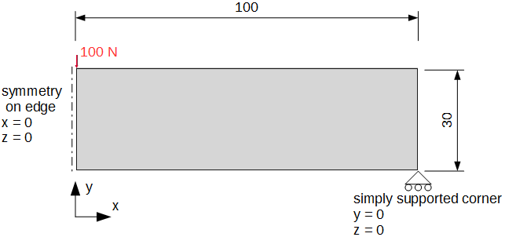
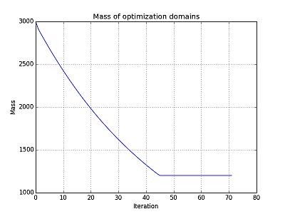
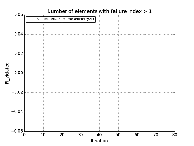
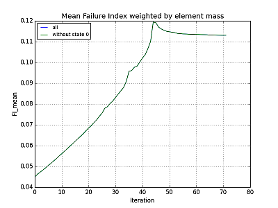
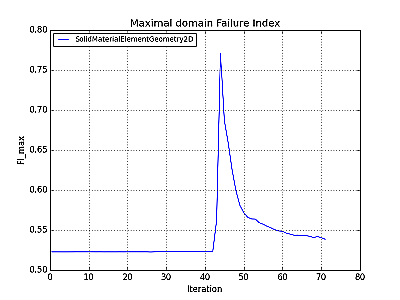
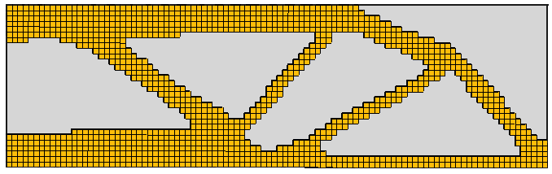
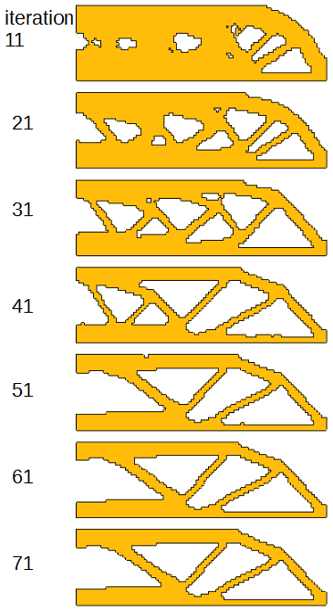

This 2D example demonstrates basic work with the code, especially how to configure basic input parameters, run optimization and display results. For simplicity and low computational costs, only 2D case is modelled and with symmetrical boundary conditions on the left side.

Prerequisites:
* Basic knowledge of finite element method
* Basic knowledge of FreeCAD FEM workbench or other preprocessing software for CalculiX

First step is to prepare common CalculiX analysis and put CalculiX input file into your working directory (special folder for each optimization model) together with files from GitHub (_beso_main.py, beso_conf.py, beso_lib.py, beso_separate.py, beso_filters.py_). You can use native [CalculiX](http://dhondt.de/) pre/postprocessor GraphiX, or you can create a mesh in [Salome](http://salome-platform.org/) or [GMSH](http://gmsh.info/) and use [CalculiX Launcher](http://calculixforwin.blogspot.cz/2015/05/calculix-launcher.html) or [PrePoMax](http://lace.fs.uni-mb.si/wordpress/borovinsek/?page_id=41) for preprocessing. Perhaps easiest way for the beginning is to use [FreeCAD](https://freecadweb.org/), which contains CalculiX solver, GMSH mesher and has basic pre/postprocessing capabilities which are user friendly.

# Preparing common analysis in FreeCAD
I used FreeCAD 0.17.10993. Geometry was made simply as one rectangular plane object.

Boundary conditions were applied on geometry: left edge is in the symmetry plane, constrained in x and z direction, right bottom corner is simply supported constrained in y and z direction, force 100 N is applied on the top left corner (which is imagine the middle of whole beam).

Material was defined with E = 210000 MPa, μ = 0.3. Shell thickness was set to 1 mm.

Finally 1 mm size 1st order quad mesh was generated with those parameters:  
`Algorithm 2D = DelQuad`  
`Characteristic length max = 1 mm`  
`Element order = 1st`  
`Recombine = True`

FreeCAD file [freecad_input.FCStd](https://github.com/fandaL/beso/blob/master/wiki_files/example_1/freecad_input.FCStd) and generated input file [Plane_mesh.inp](https://github.com/fandaL/beso/blob/master/wiki_files/example_1/Plane_mesh.inp)

# Optimization settings – for achieving goal mass
After you generated CalculiX .inp input file (e.g. in FreeCAD as explained above) you can check if it runs correctly (to prevent searching for mistake in optimization settings instead of in the original input file).

Settings are in the _beso_conf.py_ file which is easier to read if you open it in the text editor supporting python highlighting. This file contains all changeable parameters. Most of parameters have default values which are saved in _beso_main.py_, thus you can insert only necessary parameters into configuration file alone or you can modify needed parameters and let there others untouched.

It is necessary to set those parameters:
Path to the CalcliX solver (you can use launcher from FreeCAD installation) and the input file name (generated by FreeCAD)   
`path_calculix = "d:\\soft\FreeCad\\FreeCAD_0.17.10993_x64_dev_win\\bin\\ccx"`  
`file_name = "Plane_Mesh.inp"`  
and necessary parameters for domains which should be recognised by optimization program:
elset_name (name of element set) from preprocessing. In case of using FreeCAD you need to open .inp file and find "*ELSET" name; if this domain is optimized, and lists for basic properties  
`elset_name = "SolidMaterialElementGeometry2D"`  
`domain_optimized[elset_name] = True`  
`domain_density[elset_name] = [1e-6, 1]`  
`domain_thickness[elset_name] = [1.0, 1.0]`  
`domain_FI[elset_name] = [[("stress_von_Mises", 450.0e6)], [("stress_von_Mises", 450.0)]]`  
`domain_material[elset_name] = ["*ELASTIC \n210000e-6, 0.3",`  
`"*ELASTIC \n210000, 0.3"]`  
Lists contain data for allowable states according to list lengths. Second members in the lists mean that state 1 (in our case "solid" material) has effective density 1, thickness for shell elements 1.0 mm, allowable von Mises stress 450 MPa and material card in CalculiX notation (check CalculiX manual) with modulus E = 210000 MPa and Poisson's number μ = 0.3. First numbers in the lists mean that state 0 (in our case "void" material) has very low effective density 1e-6 (or cost per volume), thickness for shell elements 1.0 mm, failure criteria defined by help of maximal stress 450.0e6 MPa (very high for "void" material) and material with very low modulus E = 210000e-6 MPa and μ = 0.3.

Our optimization does not contain other domains so we do not need to define this block again. Other parameters have default values, but filtering need to be set and in our example it is worthy to look at least at these parameters:  
`mass_goal_ratio = 0.4`  
`filter_list = [["simple", 2]]`  
`optimization_base = "failure_index"`  
`mass_addition_ratio = 0.01`  
`mass_removal_ratio = 0.03`  
`ratio_type = "relative"`  
`save_iteration_results = 10`  
They mean that goal mass is 40 % of initial mass (when all elements are in the highest state). Mass is computed as volume multiplied by effective density. Filter is set to type "simple" with radius 2 mm which is in our case double mesh element size. "failure_index" is set as optimization base (evaluation criterion which elements will be removed or added). Speed is driven by mass addition and removal ratios which suggest to add 1 % of mass in each iteration and 3 % of mass to remove, so that after each iteration total mass will decrease by 2 %. Those percentages are from "relative" mass, which is mass in actual iteration. The last parameter says that results from each 10th iteration will be saved.

# Running optimization
There are more ways to run optimization:

1. Directly run _beso_main.py_. You need to have installed Python in your system to be able to run it with double click from your file viewer. It can be advantageous to open terminal (command line), and run beso_main.py by command, since in case of error window with all reports (also from CalculiX) will not close and you can find a problem easier.

2. Use Python console, e.g. QtConsole from Jupyther where I run commands:  
`cd d:\tmp\myworkdirectory`  
`import beso_main`  
Console prints optimization messages and python errors, but not CalculiX reports.

3. If you don't want care about installing python you can run _beso_main.py_ from FreeCAD since it has python console included. On Windows I used:  
`import os, sys`  
`os.chwd(“d:\\tmp\\myworkdirectory\\”)`  
`sys.path.append(os.getcwd())`  
`import beso_main`  
Note that FreeCAD will freeze without sequential reporting until whole optimization is done.

# Viewing results
Initial settings, several useful values, warning or error messages are printed into _analysis_name.log_ You can look there during running optimization. When optimization is finished values from log file are plotted and saved as png files to the working directory.

See mass being removed from initial “solid” state. Goal mass was achieved in the iteration 45. Since we set domain_density to 1 for “solid” material, mass is in fact in volume units.

Check number of violated elements (elements with stress higher then allowable). In our case there was still 0 for both domains.

FI_mean is mean failure index which inform how efficiently is material used, it increases when elements are removed since they are more loaded. FI_mean ended on value slightly more than 0.11 which means that average element stress is still far from allowable (from this point of view structure has still potential to be lighter or can be loaded more). By optimization code FI_mean is used to automatically recognise converged results if relative change in the last 5 iterations in FI_mean is less than prescribed tolerance (e.g. 0.001) which was in the iteration 71 together with achieving automatic limit number of iterations.

FI_max which is maximal failure index (= actual stress divided by allowable stress) inform about extremes in the model. Our model is loaded at 1 node and simple support is also at 1 node and failure index is still under 1 (no element is failing). Visible peak is caused probably by disconnecting some mesh links (see figure below for iteration 41 and 51).

Resulting mesh is in the file with last number, in our case file71_res_mesh1.inp for “solid” material (which is state 1), “void” elements (elements of state 0) are stored in file71_res_mesh0.inp. You can drag-and-drop first file to FreeCAD and see the mesh or read it in other postprocessor.

Or more comfortably use [Paraview](https://www.paraview.org/) to open "resulting_states.vtk" and look at mesh changes during the whole optimization.

Since we set optimization to save each 10th iteration we can check also those resulting meshes in FreeCAD (file11_res_mesh1.inp, file21_res_mesh1.inp,…),

or look at VTK files in Paraview (file11.vtk, file21.vtk,…) which contain all failure indices and sensitivity numbers mapped on the mesh for more detailed check.

# Result notes
1. Although efficiency of remaining material increases, overall stiffness of the part decreases due to material removing.
2. The resulting mesh has not smooth boundary, so you would probably use it for inspiration how to create real part.
3. Stresses used in the algorithm are set to be maximal von Mises stresses from integration points inside each element. They are different from stresses in nodes.
4. Quality of the result depends on the input parameters and the mesh.
5. **Keep in mind that this code is rather experimental**, not comprehensively tested. The method can give results close to the mathematical optimum but it can also completely fail!