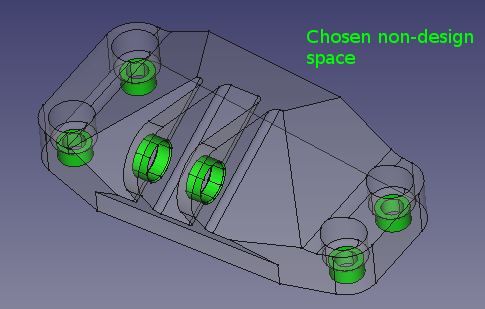
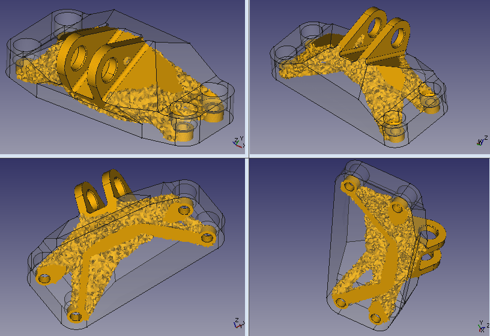
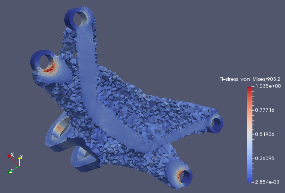

# Example 2

* [Model preparation](#model-preparation)
* [Optimization settings](#optimization-settings)
* [Results](#results)

This example describes bracket optimization. Model is from GE jet engine bracket challenge from 2013. It is possible to download step model of the design space from the [competition website](https://grabcad.com/challenges/ge-jet-engine-bracket-challenge). Material and 4 load cases are also taken from there. In fact I have not (yet) finished designing to the phase of manufacturable model - it would need to smooth mesh or recreate the shape in the CAD and check again if stresses lie in the limits.

## Model preparation

Model was prepared in FreeCAD. Input files are available here (FreeCAD geometry and analysis without the mesh, CalculiX input, optimization configuration file and actual code which I keep with each task files).

Geometry was divided by intersections to obtain non-design space around bolts and a pin.

The ring around the pin was sliced by planes to obtain faces to apply load forces (35586 N, 37810 N, 42258 N, 564921 Nmm as a force couple 19770 N).

Material Ti6Al4V (E = 114 GPa, Poisons ratio 0.33) is prescribed for non-design space and separately for the rest to obtain element sets used by CalculiX.

Faces in the bolt holes are fixed.

Mesh: I used 2 mm mesh size, initially 1st order tetrahedrons (TETRA4) and for comparison also 2nd order (TETRA10).

From parameters to write CalculiX input I set "Split Input Writer = true" for easier hand editing and "Matrix Solver Type = iterativecholesky" which is less memory consuming and for purely volume elements could be faster.

Since FreeCAD does not yet support multiple analysis steps, I divided loads into 4 steps manually in the input files. Each new one with definition `*cload, op=new`

## Optimization settings

To keep description short I would mention only some input parameters from beso_conf.py:

Optimized elements `elset_name = "SolidMaterial001Solid"` and non-optimized (monitoring) `elset_name = "SolidMaterialSolid"` are taken from the .inp file. Density is set to titanium density 0.00443 g/mm3,  allowable von Mises stress is set to 903.2 MPa according to competition rules. Material properties must be set in the configuration file (E = 114 GPa, Poisons ratio 0.33) since they are not taken from original CalculiX input generated by FreeCAD. Filter was set as "simple" with radius 4 mm (2times mesh size). `Mass_addition_ratio` resp. `mass_removal_ratio` were 0.03 resp. 0.06.

## Results

Optimization stopped after 57 iterations. Optimized domain dropped from mass of 2035 g to 430 g not counting 19 g of non-optimized domain (around holes). Model ended with 4 elements slightly exceding prescribed allowable stress close to the bolt hole. Rest of elements is less stressed. It might be possible to prescribe larger non-design space around bolts to decrease stress concentration so that more material from the rest of the model might be removed. Using finer mesh could also help. It should be noted that monitored stress is taken from integration points (inside elements) which is different from nodal stress.

Input and output files are available to look in the [zip file](doc_files/example_2/input_and_results.zip). This figure is from Paraview by use of Filters/Common/Treshold where threshold is set by "element_states" minimum above 0 and coloring by "FI=stress_von_Mises/903.2".
